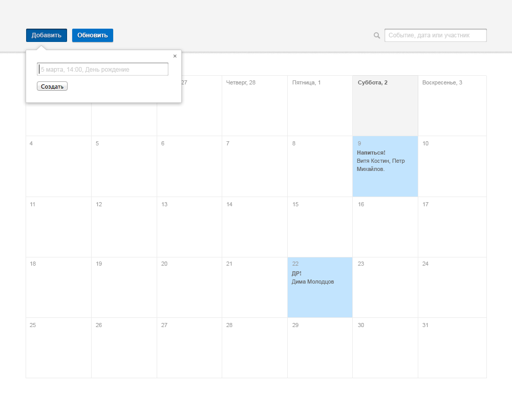

Тестовое задание для разработчика frontend
==========================================

Сверстать SPA приложение "КАЛЕНДАРЬ" в соответствии с макетом ниже.  
Серверной части программировать не надо.  
Необходимо решить задание с использованием Reac/ Angular / Vue (любой на выбор).

Результат разместите на GitHub и в письме пришлите ссылку на GitHub pages.

Плюсом будет реализация любой дополнительной JS-логики работы календаря:
 * добавление/редактирование событий
 * переход по месяцам
 * поиск
 * сохранение календаря в localStorage
 * использование Redux
 * методология чистых функций
 * покрытие чистых функций тестами

### Примеры дополнительной логики работы

Добавление события

Быстрое добавление события

Просмотр события + редактирование описания

Поиск:

